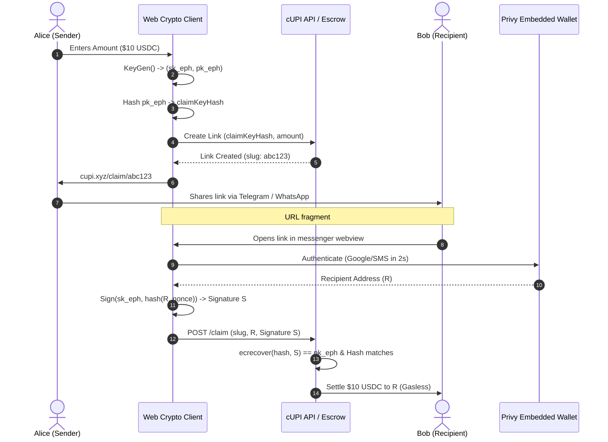
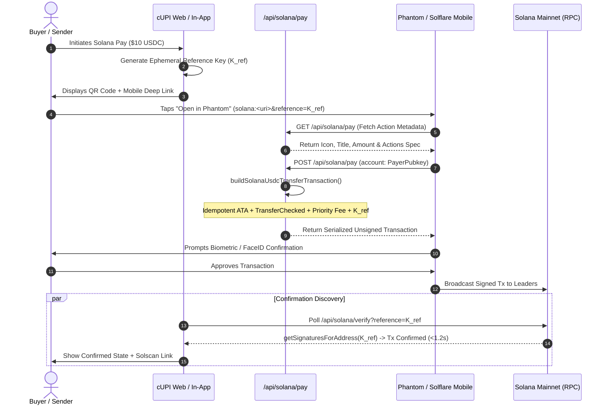

# System Architecture & Settlement Engine Specification

**Document ID:** RFC-001  
**Status:** Current  
**Authors:** 0xShikhar
**Related:** [BENCH-001 Measured Capacity Baseline](benchmark.md) · [RFC-002 Infrastructure Scaling Roadmap](scaling-1m-rpm.md)
**Scope:** Payment routing, cryptographic link encapsulation, multi-chain settlement (Solana & Base), and distributed idempotency.

---

## 1. Context & Objectives

cUPI is a high-performance, non-custodial crypto payment infrastructure network engineered for peer-to-peer transfers, universal payment links, merchant checkout sessions, and mobile messenger webviews (Telegram, WhatsApp). Unlike traditional Web3 interfaces that depend on desktop browser extension injection (`window.ethereum` / `window.solana`), cUPI routes payments over standard web protocols (HTTPS, RFC 3986 URL fragments, and deep-link schemes).

### 1.1 Goals
* **Zero-Extension Execution:** Enable payment link generation and settlement inside sandboxed in-app browsers without native extension APIs.
* **Deterministic Double-Spend Prevention:** Guarantee strict single-execution semantics across distributed serverless instances under concurrent request spikes.
* **Non-Custodial Claim Flow:** Ensure private keys and claim secrets are never exposed to or stored by application servers.
* **Sub-2-Second Confirmation:** Provide real-time UI confirmation on Solana and EVM Layer 2s without generic account balance polling.

### 1.2 Non-Goals
* **Cross-Chain Atomic Swaps:** cUPI does not implement synchronous cross-chain atomic swaps across heterogeneous VMs (e.g., Solana to EVM atomic lockups); routing is handled natively per-chain or via asynchronous intent fillers.
* **Full Node Operation:** The system delegates block verification to dedicated RPC infrastructure and focuses on client-side signing and transaction propagation.

---

## 2. High-Level System Architecture

```
                    ┌─────────────────────────────────────────┐
                    │      Client / In-App Messenger Webview  │
                    │   (Web Crypto API, Privy Embedded SDK)  │
                    └────────────────────┬────────────────────┘
                                         │
                   ┌─────────────────────┴─────────────────────┐
                   │                                           │
         [Client-Side Claim Link]                    [Solana Pay / Actions]
      URL Fragment: #key=0x... (RFC 3986)          solana:<recipient>?amount=...
                   │                                           │
                   ▼                                           ▼
      ┌─────────────────────────┐                 ┌─────────────────────────┐
      │   Next.js API Gateway   │                 │    Next.js Actions API  │
      │   - /api/payment-links  │                 │    - /api/solana/pay    │
      │   - /api/resolve        │                 │    - /actions.json      │
      └────────────┬────────────┘                 └────────────┬────────────┘
                   │                                           │
                   ▼                                           ▼
      ┌─────────────────────────┐                 ┌─────────────────────────┐
      │ Distributed Idempotency │                 │  Solana Transaction     │
      │ (PostgreSQL / PgBouncer)│                 │  Builder (solana-usdc)  │
      │ Atomic Row State Locks  │                 │  - Idempotent ATA       │
      └────────────┬────────────┘                 │  - Compute Budget CU    │
                   │                              │  - Ephemeral Ref Key    │
                   ▼                              └────────────┬────────────┘
      ┌─────────────────────────┐                              │
      │ EVM ERC-4337 Settlement │                              ▼
      │ - Base (8453 / 84532)   │                 ┌─────────────────────────┐
      │ - Bundler & Paymaster   │                 │ Solana Validator RPC    │
      │ - Escrow Vault Contract │                 │ (Confirmed Commitment)  │
      └─────────────────────────┘                 └─────────────────────────┘
```

---

## 3. Cryptographic Link Encapsulation (In-Chat Transfers)

To allow payments to travel through insecure channels (e.g., public group chats or SMS) without third-party escrow risk, cUPI utilizes client-side asymmetric key encapsulation.

### 3.1 Link Generation Flow
1. The sender inputs amount $A$ and token $T$.
2. The sender's browser invokes `window.crypto.subtle` to generate an ephemeral keypair:
   $$(sk_{eph}, pk_{eph}) \leftarrow \text{KeyGen}()$$
3. The client computes a cryptographic commitment:
   $$H_{claim} = \text{keccak256}(pk_{eph})$$
4. The client deposits funds into the escrow vault or records the link state by passing only $H_{claim}$ to the backend.
5. The URL is assembled with the private key contained strictly in the hash fragment:
   $$\text{URL} = \text{https://cupi.xyz/claim/}\langle \text{slug} \rangle\mathbf{\#key=}sk_{eph}$$
   * **RFC 3986 Compliance:** Per HTTP specification, fragments are stripped by user agents prior to network transmission. The application server never receives, logs, or stores $sk_{eph}$.

### 3.2 Claim & Verification Flow
1. Recipient opens the link. The in-app webview extracts $sk_{eph}$ from `window.location.hash`.
2. Recipient authenticates via Privy embedded wallet to obtain recipient address $R$.
3. Recipient uses $sk_{eph}$ to sign an authorization payload:
   $$S = \text{Sign}_{sk_{eph}}(\text{keccak256}(R \mathbin{\Vert} \text{nonce} \mathbin{\Vert} \text{chainId}))$$
4. The signature $S$ and address $R$ are submitted to `/api/payment-links/[slug]/claim`.
5. The smart contract or backend verifies:
   $$\text{ecrecover}(\text{hash}, S) = pk_{eph} \quad \text{and} \quad \text{keccak256}(pk_{eph}) = H_{claim}$$
6. Funds are released directly to $R$. The link is marked `CLAIMED` in an atomic database transaction.

### 3.3 Protocol Sequence Diagram



---

## 4. Multi-Chain Settlement Specifications

### 4.1 Solana Sealevel Engine (SPL USDC)
cUPI's Solana engine (`src/lib/solana/solana-usdc.ts`) implements the official Solana Pay Transaction Request standard and Action Spec v2.

#### A. Idempotent ATA Initialization
Sending SPL tokens to a counterparty requires an Associated Token Account (ATA). Standard transactions revert if the account does not exist or if duplicate initialization is attempted.
* cUPI prepends `createAssociatedTokenAccountIdempotentInstruction`:
  * If the ATA is absent: Allocates space and funds rent exemption atomically.
  * If the ATA is present: Acts as an in-VM no-op without terminating execution.
  * **Result:** Zero onboarding failure rate when sending USDC to uninitialized addresses.

#### B. Ephemeral Reference Keys
To detect transaction finality without state polling:
* Each session generates a random public key $K_{ref}$.
* $K_{ref}$ is appended as a non-signing, non-writable account key in the transfer instruction.
* Verification worker queries `getSignaturesForAddress(K_{ref}, { limit: 1 })`.
* Because $K_{ref}$ is unique per transaction, lookups bypass account lock contention and avoid rate-limiting on high-volume recipient wallets.

#### C. Compute Budget & Congestion Strategy
To ensure mainnet transaction inclusion during periods of validator scheduling congestion:
```ts
ComputeBudgetProgram.setComputeUnitLimit({ units: 200_000 });
ComputeBudgetProgram.setComputeUnitPrice({ microLamports: 50_000 });
```
Additionally, transfers use `createTransferCheckedInstruction` to strictly enforce mint address (`EPjFWdd...`) and decimal scale (6), preventing decimal mismatch attacks.

#### D. Solana Pay & Reference Settlement Sequence



---

### 4.2 EVM Layer 2 Architecture (Base)

cUPI abstracts network complexity for EVM chains through ERC-4337 Account Abstraction:

```
┌──────────────┐     ┌──────────────┐     ┌──────────────┐     ┌──────────────┐
│ User Signs   │ ──> │ cUPI API     │ ──> │ ERC-4337     │ ──> │ Target Chain │
│ UserOp Hash  │     │ Policy Check │     │ Bundler RPC  │     │ L2 Mempool   │
└──────────────┘     └──────────────┘     └──────────────┘     └──────────────┘
                            │                    │
                            ▼                    ▼
                     [Paymaster Signs]     [Batch Packing]
```

* **Base Mainnet (`chainId: 8453`):** Primary consumer route. Block times: 2.0s. Gas subsidization costs average `<$0.001` per transfer post-EIP-4844 blobs.
* **Base Sepolia (`chainId: 84532`):** Testnet environment for staging and CI verification.

Additional EVM chains are an RFC-002 roadmap concern; the shipped surface is Solana + Base end to end.

---

## 5. Distributed Financial Idempotency

To prevent double-spend attacks, duplicate processing, and client retry inconsistencies across serverless functions, all mutating routes enforce `Idempotency-Key` headers (`src/lib/payments/idempotency.ts`).

### 5.1 Lock State Machine

```
              ┌─────────────────────────┐
              │ Incoming Request (Key)  │
              └────────────┬────────────┘
                           │
             ┌─────────────┴─────────────┐
             ▼                           ▼
       [Record Found]             [No Record Found]
             │                           │
     ┌───────┴───────┐                   ▼
     │               │          Acquire Row Lock:
[COMPLETED]      [PENDING]       Status = PENDING
     │               │           LockedAt = now()
     ▼               ▼                   │
Replay Cached   Age < 60s?               ▼
Response +      ├── YES: Return 409      Execute Transaction
Headers         └── NO: Reclaim Lock             │
                         │                       ▼
                         └──────────────> Status = COMPLETED
                                          Response = Body JSON
```

### 5.2 Failure & Conflict Semantics
* **Concurrent Collision:** If request $B$ arrives while request $A$ is actively processing with the same key, $B$ is immediately rejected with `HTTP 409 Conflict` (`IDEMPOTENCY_IN_FLIGHT`) in `<15ms`.
* **Lock Expiry / Reclaim:** If a process crashes mid-execution, locks expire after `60,000ms`, allowing recovery without permanent deadlock.
* **Replay Transparency:** Responses served from cache include the `X-Idempotent-Replay: true` header.

---

## 6. Capacity & Throughput Baseline

Capacity figures are divided into **measured** values (produced by the BENCH-001 harness — see [`docs/benchmark.md`](benchmark.md)) and **design targets** (engineering objectives verified at rollout).

| Subsystem | Classification | Capacity | Basis |
| :--- | :--- | :--- | :--- |
| **API Ingress (per instance)** | **Measured** | ~346,000 req/min blended (~5,766 req/s) | BENCH-001 §4.1, c=500, single `next start` process |
| **Raw route handling (`/api/ping`)** | **Measured** | ~120,000 req/min | BENCH-001 §4.1 |
| **Directory resolution (`/api/resolve`)** | **Measured** | ~86,800 req/min; p50 68ms hot / ~300ms cold | BENCH-001 §4.1 |
| **Client Link Creation** | Architectural property | Unbounded by backend | 100% in-browser asymmetric key derivation — zero server or RPC load per link |
| **Idempotency Store** | Design target | ≥100K checks/min | Postgres row locks today; Redis Lua check-and-set per RFC-002 Phase 1 |
| **Settlement Pipelines** | Design target | Per RFC-002 | Solana SWQoS + gRPC push; EVM multi-bundler sharding |

The fleet-level scaling path to **1,000,000 requests/minute** — topology, capacity model, and phase gates — is defined in [RFC-002](scaling-1m-rpm.md).

---

## 7. Endpoint Verification

The following commands exercise the production endpoints directly against a running server (`bun dev` on port 3000):

```bash
# 1. Inspect Solana Actions & Blinks Manifest
curl -s http://localhost:3000/actions.json | jq

# 2. Fetch Solana Pay Action Metadata
curl -s "http://localhost:3000/api/solana/pay?amount=25&memo=Dinner" | jq

# 3. Test Handle and Phone Directory Resolution
curl -s "http://localhost:3000/api/resolve?identifier=@alice" | jq
curl -s "http://localhost:3000/api/resolve?identifier=+15550192834" | jq

# 4. Verify Reference Key Listener (Returns pending for new key)
curl -s "http://localhost:3000/api/solana/verify?reference=7xKXtg2CW87d97TXJSDpbD5jBkheTqA83TZRuJosgAsU" | jq
```

---

## 8. Implementation Boundaries & Production Realities

To maintain complete architectural integrity, this section explicitly outlines the operational boundaries between **production-active logic**, **staged infrastructure with fallbacks**, and **planned institutional facades**:

| Subsystem | Architectural Tier | Current Reality in Codebase | Staging / Fallback Behavior |
| :--- | :---: | :--- | :--- |
| **Solana Pay & Blinks v2** | **Tier 1: Live & Active** | Fully implemented in [`solana-usdc.ts`](../src/lib/solana/solana-usdc.ts), `/actions.json`, and `/api/solana/pay`. Priority fees (50k µLamports) and idempotent ATA creation are active. | Operates directly against Solana Devnet and Mainnet-Beta RPCs. |
| **Client-Side Link Escrow** | **Tier 1: Live & Active** | Web Crypto asymmetric key derivation (`#key=...`) and ECDSA verification execute in-browser. Server never touches claim secrets. | Claims are validated client-side and currently settled via relayer rather than a deployed factory contract. |
| **Distributed Idempotency** | **Tier 1: Live & Active** | PostgreSQL atomic row locks via `prisma.idempotencyRecord` with in-memory fallback. | Blocks duplicate concurrent requests in `<15ms` with `HTTP 409 Conflict`. |
| **Privy MPC Self-Custody** | **Tier 1: Live & Active** | Embedded user wallets, user key export (`/profile`), and atomic database profile upserts. | Eliminates server-side private key storage. |
| **ERC-4337 Bundler & Paymaster** | **Tier 2: Staged / Fallback** | Biconomy client and Paymaster sponsorship policy logic are implemented in [`paymaster-client.ts`](../src/lib/aa/paymaster-client.ts). | **Production Reality:** A self-hosted production bundler is **not** currently deployed. When gasless conditions are unmet or bundlers experience latency, the client gracefully falls back to direct Privy embedded wallet signing (`useSmartAccount.ts`). |
| **On-Chain Escrow Smart Contract** | **Tier 2: Staged / Fallback** | Solidity calldata encoding and lifecycle bindings are implemented and unit tested in [`escrow-vault.ts`](../src/lib/contracts/escrow-vault.ts). | **Production Reality:** `EscrowVault.sol` is not yet deployed to Base Mainnet; active claim links settle via relayer transfer. |
| **Fintech Ramps (Bridge, Rain, Sumsub)**| **Tier 3: Facade Layer** | Full TypeScript interfaces, webhook HMAC-SHA256 signature verifiers, and simulation algorithms are built and tested in [`src/lib/integrations/`](../src/lib/integrations). | **Production Reality:** Live fiat bank wires require signed enterprise partnership agreements and live API credentials. In local/dev environments, these operate in sandbox/mock mode. |
| **Autonomous AI Agent Runtime** | **Tier 3: Facade / Rules** | Spend guardrails (daily caps, session keys) and DeFi calldata providers (Uniswap, Moonwell) are verified. | **Production Reality:** Agent chat currently runs on structured deterministic rules rather than continuous autonomous background LLM cron loops. |


